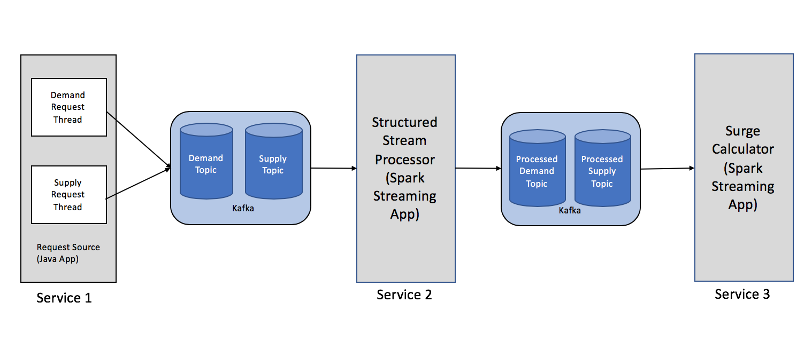

# surge-price-prototype
Surge-pricing prototype project using kafka and spark-streaming

## Description
This is a prototype project, programmed to calculate surge pricing used by 
online cab companies. This is a sample project and solely intended for learning 
and understanding the platforms used. This application is written in
java and scala and follows a micro-service architecture with kafka as the 
inter-process communication medium.

## Architecture Diagram

